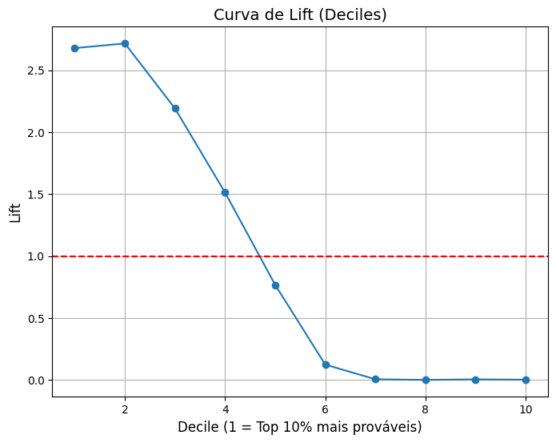

# Health Insurance Cross Sell Prediction


## 1. Project Overview
  Esse projeto tem o objetivo de treinar um modelo de classificação binária para prever se clientes tem interesse em seguro de veículos de uma empresa utilizando dados do ano anterior.
  Esse estudo é de extrema importância, pois pode ajudar a empresa a planejar suas estratégias de comunicação para alcançar clientes e otimizar seu modelo de negócios e receita.

  [Fonte dos dados](https://www.kaggle.com/datasets/anmolkumar/health-insurance-cross-sell-prediction)

## 2. Repository Structure
  O repositório possui a seguinte estrutura principal:
  
- **analysis/**: Classes e métodos gerais para análise de dados (univariada, multivariada, inspeção geral).    
- **app/**: Script que carrega o pipeline final (`pipeline_prod.pkl`) e expõe uma rota via FastAPI para gerar previsões.  
- **models/**: Pipelines treinados e pré-processadores (`pipeline_preprocessor.pkl`, `pipeline_train.pkl`, `pipeline_prod.pkl`).  
- **transformers/**: Transformadores personalizados, como `PeakValueTransformer()` e `IQROutlierRemover()`, utilizados no pipeline.  
- **assets/**: Imagens e gráficos usados no README e relatórios.  
- **data/**: Datasets brutos e processados necessários para treinar e testar os modelos. 
- `EDA.ipynb` → Análise exploratória detalhada usando as classes de `analysis/`.  
- `main.ipynb` → Pipeline completo: pré-processamento, treino, tuning e avaliação.

### FastAPI + Docker

O projeto pode ser executado dentro de um **container Docker**:

- Construir a imagem:
```bash
docker build -t health-insurance-api .
```

- Rodar o container:
```bash
docker run -p 8000:80 health-insurance-api
```

- A API estará disponível em http://127.0.0.1:8000, permitindo gerar previsões sem precisar rodar os notebooks.
- Para reproduzir os resultados, comece pelos notebooks (EDA.ipynb e main.ipynb).
- O pipeline final utilizado na API está em `models/pipeline_prod.pkl`.


  ## 3. Data Description

  | Variável | Definição |
  | -------- | -------- |
  | id  | Id exclusivo do cliente |
  | Gender  | Gênero do cliente |
  | Age  | Idade do Cliente |
  | Driving_License  | Se o cliente possui carteira de habilitação |
  | Region_Code  | Código exclusivo para a região do cliente |
  | Previously_Insured  | Se o cliente já tem seguro  |
  | Vehicle_Age  | Idade de Veículo |
  | Vehicle_Damage  | Se o cliente já teve seu veículo danificado no passado |
  | Annual_Premium  | O valor  que o cliente precisa pagar como prêmio |
  | Policy_Sales_Channel  | Código anonimizado para o canal de divulgação do cliente |
  | Vintage  | Número de dias que o cliente está associado a empresa |
  | Response  | Variável resposta se o cliente está ou não interessado na recontratação |
   

## 4. Data Analysis & Insights
### 4.1 Overview
- The dataset contains **381,109 entries** and **10 columns**;
- The target variable **Response** is imbalanced, with approximately 12% positive classes;
- There are **no missing values** in the dataset;
-  **Numerical Features:** `Age`, `Annual_Premium` and `Vintage`;
-  **Categorical Features:** Variables `Region_Code` and `Policy_Sales_Channel` has many unique values;
-  **Low-variance Features:** `Driving_License` has **99.8%** of its values equal to 1;
- The variable **Policy_Sales_Channel** has 3 concentrated distributions of its categorical values.
- The **Annual_Premium** distribution is positively skewed, with the value **$2360.0** ocurring at approximately 17% outside the main distribution
- **Region_ Code** distribution is varied, with 28 being the most common code. Most other codes have very few observations;

  ### 4.2 Insights
  A análise inicial sugere que algumas variáveis possuem alto potencial preditivo, enquanto outras podem ser simplificadas ou descartadas:
    - `Driving_License` pode ser removida sem impactar o target.
    - `Policy_Sales_Channel` deve ser agrupada em 3 clusters para reduzir dimensionalidade e manter relevância.
    - `Region_Code` pode ser reduzida para top 10 códigos, agrupando os demais em categoria “Other”.
    - `Annual_Premium` e `Vintage` podem necessitar de transformações e tratamento de outliers.
  ### 4.3 Preprocessing & Feature Engineering
  Para preparar os dados para os modelos de Machine Learning, foram aplicadas as seguintes etapas:
  - **Balanceamento da base:** Oversampling com **SMOTE** para lidar com a classe desbalanceada.
  - **Escalonamento:** Aplicação de **StandardScaler** nas variáveis numéricas.
  - **Encoding de variáveis categóricas:**
    - `Region_Code` e `Policy_Sales_Channel` tratados com clusterização / agrupamento.
    - Evitou-se **One-Hot Encoding** devido ao alto número de categorias.
  - **Tratamento de outliers:** Consideração de transformação logarítmica ou winsorization para `Annual_Premium`.

  ### 4.4 Insights Summary
  - Variáveis como `Age`, `Vehicle_Damage` e `Previously_Insured` possuem maior relevância na predição do interesse em seguros.
  - Variáveis de baixa variância (`Driving_License`) ou com muitos níveis pouco frequentes (`Policy_Sales_Channel`, `Region_Code`) foram reduzidas ou agrupadas.
  - A preparação adequada do dataset garante que os modelos subsequentes possam aprender padrões relevantes sem ruído ou sobreajuste.

  

## 5. Model Evaluation
### 5.1 Model Comparison
  Em cenários de marketing preditivo e recomendação, nem sempre é viável abordar todos os clientes classificados como potenciais         compradores. Optou-se por avaliar o desempenho do modelo utilizando as métricas [`Precision@k` e `Recall@k`](https://krishnapullak.medium.com/understanding-precision-recall-and-f-score-at-k-in-recommender-systems-7146a0dce68e), que medem a qualidade das previsões considerando apenas os clientes com as maiores probabilidades de aceitação.

 Dessa forma foram avaliados 5 modelos utilizando as métricas `AUC`, `Recall@k` e `Precision@k`. Abaixo é apresentado uma tabela resumo dos modelos. O valor de **k** escolhido foi 0.2.
 
  | Modelo | AUC | Recall@0.2 | Precision@0.2 |
  | -------- | -------- | -------- | -------- |
  | Decision Tree | 0.60 | 0.37 | 0.22 |
  | Random Forest | 0.82 |0.49 | 0.30 |
  | Logistic Regression | 0.82 | 0.47 | 0.29 |
  | Gradient Boosting | 0.84 | 0.53 | 0.33 |
  | K-Nearest Neighbors (KNN) |0.79 | 0.46 | 0.28 |

  Alguns modelos apresentaram `AUC` maior que 0.8. Dentre esses modelos, o que apresentou o melhor valor para `recall_at_k%` foi selecionado, ou seja, o modelo **Gradient Boosting** foi escolhido para os próximos passos.

### 5.2. Selected Model: Gradient Boosting
#### 5.2.1 Hyperparameter Tuning
  A ferramenta de otimização de hiperparâmetros que foi utilizada foi o `GridSearchCV` utilizando a métrica `recall` para o melhorar o modelo. Isso porque temos uma variável target desbalanceada e precisamos focar em prever clientes que irão assinar com a seguradora de veículos. Dessa forma, os hiperparâmetros encontrados foram 
  - **learning_rate**: 0.05
  - **max_depth**: 1
  - **n_estimators**: 200

#### 5.2.2 Model Performance
##### Recall and Precision
A partir dos hiperparâmetros encontrados na seção anterior, o modelo foi treinado e atingiu as métricas da tabela abaixo

|  | Train | Test |
| -------- | -------- | -------- |
| Recall | 0.9098 | 0.9085 |
| Precision | 0.2774 | 0.2787 |

O modelo tem **alto recall**, o que indica que o modelo é sensível a classe positiva, porém o modelo apresenta um **baixo precision**, então muitos clientes são classificados na classe positiva mas na verdade não compram. Podemos afirmar que o modelo generaliza bem, mas tende a classificar muitos clientes como positivo para garantir que todos os reais sejam incluídos.

Além disso, foram avaliadas as métricas `Recall@k` e `Precision@k´ para o modelo final


|  | Train | Test |
| -------- | -------- | -------- |
| Recall@k | 0.538 | 0.540 |
| Precision@k | 0.330 | 0.331 |

Considerando os 20% da base com maior probabilidade de compra (top 20%), aproximadamente 54% dos clientes reais estão incluídos nesse grupo. Ou seja, mais da metade dos compradores reais foram priorizados, enquanto cerca de 33% dos clientes selecionados realmente efetuariam a compra.
Esses resultados indicam que o modelo consegue concentrar uma proporção significativa de compradores reais no subconjunto mais relevante da base, embora ainda haja uma quantidade considerável de falsos positivos.
A pequena diferença entre os conjuntos de treino e teste sugere que o modelo generaliza bem, sem sinais de overfitting.

##### Lift Curve
 Observa-se que, ao considerar os 20% da base com maior probabilidade de compra, o modelo selecionado apresenta um desempenho aproximadamente três vezes superior ao de uma abordagem aleatória.
 


## 6. Bussiness Insights
- O modelo concentra compradores reais nos clientes mais prováveis, facilitando campanhas de marketing direcionadas.
- Apesar do baixo precision, o alto recall garante que a maioria dos clientes interessados seja abordada.
- Estratégias futuras podem incluir ajuste do threshold ou coleta de novas features para aumentar a precisão.


fastapi
kaggle
